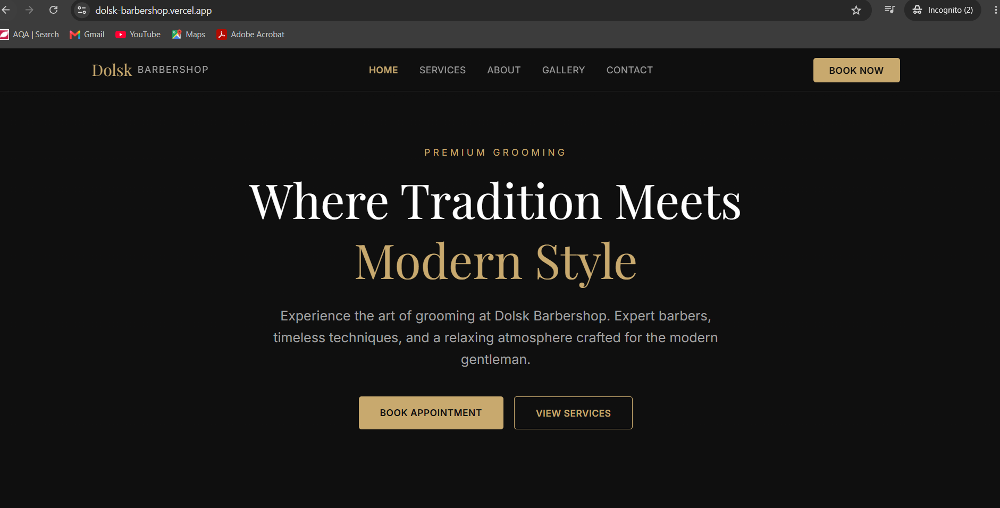

# Dolsk Barbershop

A modern, premium barbershop website built for the CommunityBytes Web Developer Technical Assessment. Features a fully functional booking system, responsive design, and a dark luxury aesthetic.



## Live Demo

🔗 **Live Site:** [dolsk-barbershop.vercel.app](https://dolsk-barbershop.vercel.app)

## Features

- **Responsive Design** — Fully optimized for mobile, tablet, and desktop
- **Booking System** — Complete appointment flow with calendar, time slots, and WhatsApp confirmation
- **Dynamic Calendar** — Shows available dates, disables closed days (Sundays), respects business hours
- **WhatsApp Integration** — Generates pre-filled booking messages
- **No Dead Ends** — Every clickable element provides visual feedback
- **SEO Optimized** — Proper meta tags, heading hierarchy, and Open Graph data
- **Accessible** — Semantic HTML, keyboard navigation, focus indicators, proper labels
- **Performance Focused** — Optimized fonts, minimal bundle, static generation where possible

## Pages

| Page | Description |
|------|-------------|
| Home | Hero section, services preview, testimonials, CTAs |
| Services | Full service list with pricing and "Book Now" buttons |
| About | Brand story, values, team members |
| Gallery | Filterable image grid with lightbox |
| Contact | Contact form with validation, business hours, WhatsApp link |
| Booking | 4-step booking flow: Service → Date/Time → Details → Confirmation |

## Technologies Used

- **Framework:** Next.js 16 (App Router)
- **Language:** TypeScript
- **Styling:** Tailwind CSS 4
- **Fonts:** Google Fonts (Playfair Display, Inter)
- **Deployment:** Vercel
- **Linting:** ESLint

## Getting Started

### Prerequisites

- Node.js 20+ installed
- npm or yarn

### Installation

```bash
# Clone the repository
git clone https://github.com/fiskhumalo/dolsk-barbershop.git

# Navigate to project
cd dolsk-barbershop

# Install dependencies
npm install

# Run development server
npm run dev
```

Open [http://localhost:3000](http://localhost:3000) in your browser.

### Build for Production

```bash
npm run build
npm start
```

## Project Structure

```
src/
├── app/                  # Pages (App Router)
│   ├── page.tsx          # Home page
│   ├── layout.tsx        # Root layout (navbar + footer)
│   ├── globals.css       # Design system (colors, fonts)
│   ├── not-found.tsx     # 404 page
│   ├── about/            # About page
│   ├── services/         # Services page
│   ├── gallery/          # Gallery page
│   ├── contact/          # Contact page
│   └── booking/          # Booking system
├── components/           # Reusable UI components
│   ├── Navbar.tsx        # Navigation bar
│   └── Footer.tsx        # Site footer
└── constants/            # Shared data
    ├── services.ts       # Service definitions
    └── business-hours.ts # Operating hours config
```

## Design Decisions

- **Dark theme with gold accents** — Premium, luxury barbershop aesthetic
- **Playfair Display for headings** — Classic serif font with barber heritage feel
- **Inter for body text** — Clean, modern, highly readable
- **Mobile-first approach** — Built for mobile then enhanced for larger screens
- **Component architecture** — Reusable pieces for consistency and maintainability
- **Static generation** — Pages pre-rendered at build time for fast loading

## Business Hours

| Day | Hours |
|-----|-------|
| Monday - Friday | 08:00 - 18:00 |
| Saturday | 08:00 - 14:00 |
| Sunday | Closed |

## Author

Built by Fisk Humalo for the CommunityBytes Access Web Developer Technical Assessment.

## License

This project is for assessment purposes.
